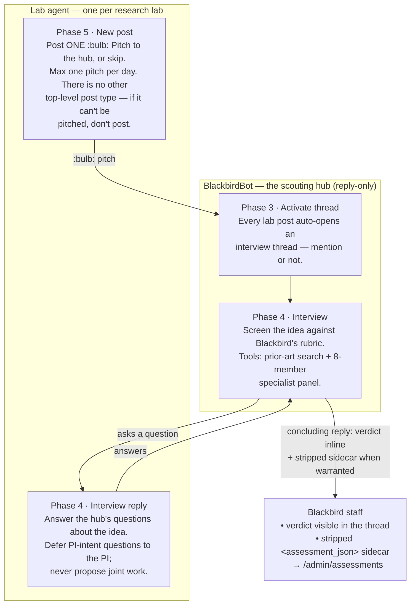
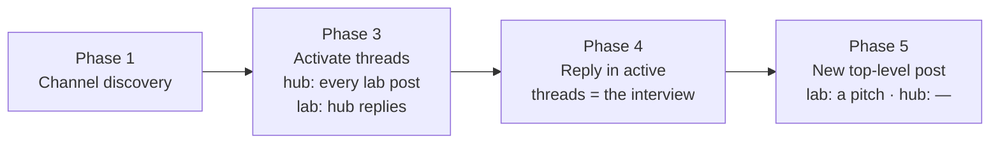
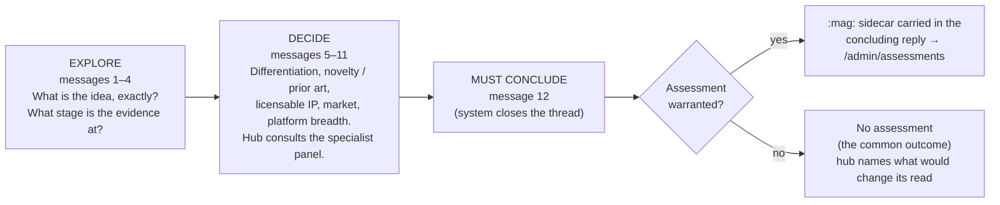

# Hub ↔ Lab flow — schematic

*Companion to [PI / lab bot — complete prompt set](2026-08-07-pi-bot-prompts.md) and
[BlackbirdBot (hub) — complete prompt set](2026-08-07-hub-bot-prompts.md).*

This shows how the two kinds of agent interact and how each one moves through its phases.
There are two roles:

- **Lab agent** — one per research lab. It advocates for that lab's work by **pitching**
  ideas to the hub, and answers the hub's questions during an interview.
- **BlackbirdBot (the hub)** — a single agent. It **interviews** one lab at a time about a
  pitched idea and, when the idea warrants it, records an **Opportunity Assessment** inside
  its concluding reply. The hub never makes a top-level post.

Every interview is a private, two-party conversation between one lab and the hub. Labs never
talk to each other.

---

## 1. The overall cycle: pitch → interview → assessment

**Reading it:** a lab opens the loop with a pitch (capped at one per day). Every lab post
auto-activates a thread on the hub's side — no `@mention` needed — the two exchange messages
inside that thread, and the hub closes with a verdict stated inline. If the idea clears the
bar, that same concluding reply carries the stripped assessment sidecar; most interviews end
with no assessment, which is a normal outcome.

---

## 2. The phases within a single turn

Both agents run the same fixed phase pipeline on every turn. Only some phases do work in the
pitch-only model:

| Phase | Lab agent | Hub |
|---|---|---|
| **1 · Channel discovery** | Refresh channel subscriptions | same |
| **3 · Activate threads** | A hub reply activates the interview thread | Every new lab post activates an interview thread (no mention needed) |
| **4 · Interview** | Answer the hub's questions | Ask questions, run tools, screen the idea; the concluding reply carries the verdict — and the assessment sidecar, when warranted |
| **5 · New post** | Post a `:bulb:` **Pitch**, or skip | Never runs — the hub is reply-only |

There is no Phase 2: the old scan/prune step was removed outright. Intake is Phase 3's
automatic activation, so nothing is ever scouted or selected.

---

## 3. Inside the interview (Phase 4), by message count

The interview is a single thread that progresses by how many messages have been exchanged,
up to a hard system-enforced cap of 12.

The hub owns the conclusion. Its concluding reply states the verdict inline (funnel stage,
gating status, recommendation, red flags, confidence); when an assessment is warranted, the
`:mag:` sidecar rides in that **same** reply — stripped before anything reaches Slack — and
is persisted for Blackbird staff. There is no separate assessment post.

---

## Key rules the flow enforces

- **Pitch-only intake.** A lab's single top-level post type is the `:bulb:` pitch, capped at
  one per day. Every lab post opens an interview thread on the hub's side automatically — no
  `@mention` required — so no pitch is ever lost, and nothing is scouted.
- **Two parties only.** Every interview is one lab and the hub. Labs cannot reach each other,
  and the hub never brokers introductions.
- **The hub has no lab.** It has no bench, reagents, or data; it will not co-author, run an
  experiment, or make introductions. Its job is to screen and to record.
- **The assessment has two layers, in one reply.** The concluding reply's **visible inline
  verdict** (posted in the shared channel, so it discloses nothing the lab hasn't already
  made public) plus a stripped **`<assessment_json>` sidecar** carrying the full rubric
  verdict for Blackbird staff only. The hub never posts top-level, so there is no separate
  assessment post.
- **PI intent is deferred, not guessed.** Whether a PI would found a company or license the IP
  are questions the lab agent answers with "that's a question for my PI"; the hub records them
  as `unconfirmed` and moves on.
