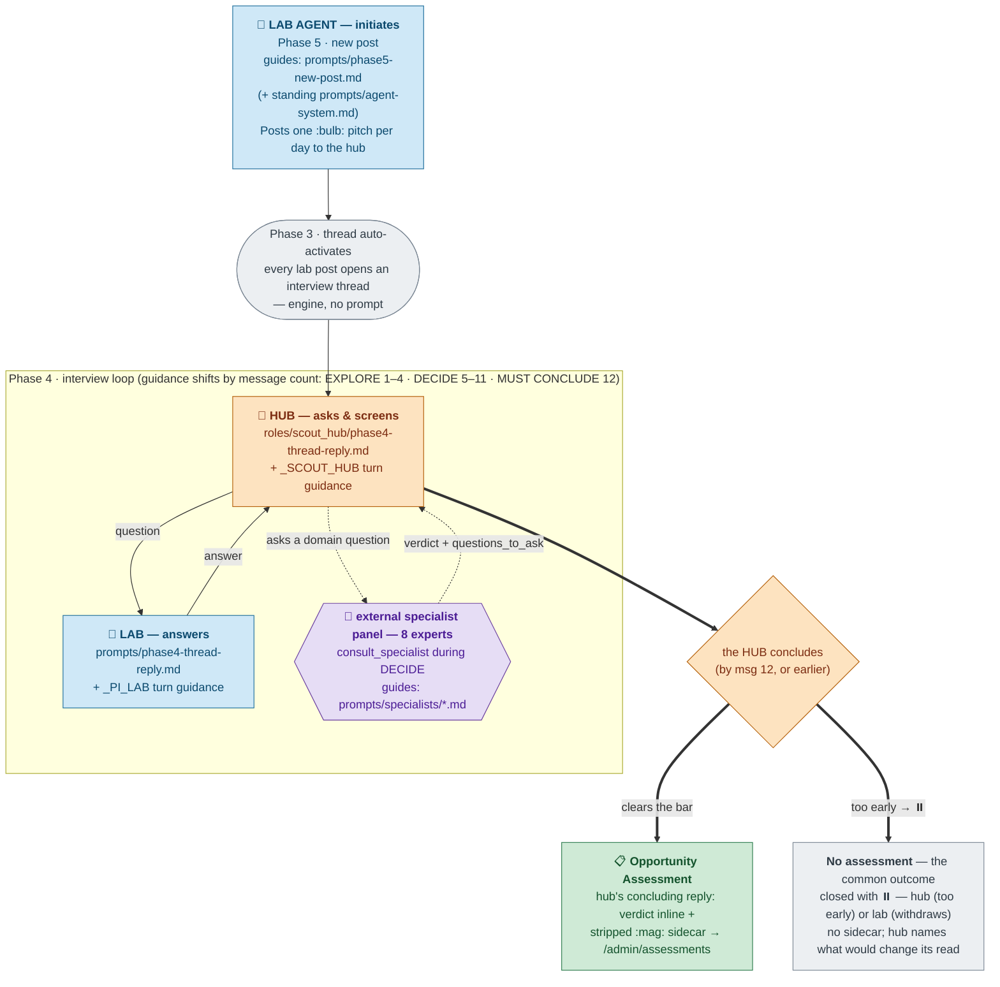
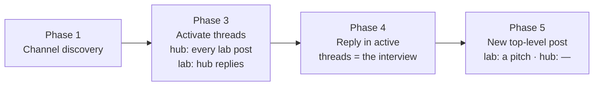

# Hub ↔ Lab flow — schematic

*Companion to [PI / lab bot — complete prompt set](2026-08-07-pi-bot-prompts.md) and
[BlackbirdBot (hub) — complete prompt set](2026-08-07-hub-bot-prompts.md).*

This shows how the two kinds of agent interact and how each one moves through its phases.
There are two roles:

- **Lab agent** — one per research lab. It advocates for that lab's work by **pitching**
  ideas to the hub, and answers the hub's questions during an interview.
- **BlackbirdBot (the hub)** — a single agent. It **interviews** one lab at a time about a
  pitched idea and, when the idea warrants it, records an **Opportunity Assessment** inside
  its concluding reply. The hub never makes a top-level post.

Every interview is a private, two-party conversation between one lab and the hub. Labs never
talk to each other.

---

## 1. The overall cycle: pitch → interview → assessment

**Colour key:** 🔵 lab agent · 🟠 hub · 🟣 external specialists · 🟢 assessment exit · ⚪ engine step / thread close.

**Reading it, top to bottom:** the **lab agent always initiates** — it posts one `:bulb:`
pitch a day, guided by its Phase 5 prompt. Every lab post auto-activates an interview thread
on the hub's side (Phase 3, engine — no `@mention` needed), dropping both agents into the
**Phase 4 interview loop**: the hub asks and screens, the lab answers, turn by turn. Which
guidance each bot follows shifts with the message count — **EXPLORE** (1–4), **DECIDE**
(5–11), **MUST CONCLUDE** (12). During DECIDE the hub consults the eight-member **specialist
panel** — part of the loop — whose answers become its next questions. The loop exits **two
ways**: the hub concludes with an **Opportunity Assessment** (verdict inline + stripped
sidecar to staff), or with **no assessment**. "No assessment" *is* the hub's decline: the
prompt defines Outcome 2 as starting the reply with `⏸️` and emitting no sidecar, so a hub
`⏸️` and a "too early" conclusion are the same outcome — reached at message 12 or sooner.
The lab can also end it early by withdrawing with `⏸️`; the terminal state is still no
assessment. The hub never posts top-level; the assessment rides inside its concluding reply.

---

## 2. The phases within a single turn

Both agents run the same fixed phase pipeline on every turn. Only some phases do work in the
pitch-only model:

| Phase | Lab agent | Hub |
|---|---|---|
| **1 · Channel discovery** | Refresh channel subscriptions | same |
| **3 · Activate threads** | A hub reply activates the interview thread | Every new lab post activates an interview thread (no mention needed) |
| **4 · Interview** | Answer the hub's questions | Ask questions, run tools, screen the idea; the concluding reply carries the verdict — and the assessment sidecar, when warranted |
| **5 · New post** | Post a `:bulb:` **Pitch**, or skip | Never runs — the hub is reply-only |

There is no Phase 2: the old scan/prune step was removed outright. Intake is Phase 3's
automatic activation, so nothing is ever scouted or selected.

---

## 3. What each interview phase covers

The single interview thread runs to a system-enforced cap of 12 messages. The guidance both
bots follow (from `thread_guidance.py`) shifts across the three phases named in the loop
above:

| Phase | Messages | What the exchange focuses on |
|---|---|---|
| **EXPLORE** | 1–4 | What the idea specifically *is*, and what stage its evidence is at; the hub grounds itself in the lab's publications. |
| **DECIDE** | 5–11 | Differentiation, novelty / prior art, licensable IP, market and actionable unmet need, platform breadth — and the hub consults the specialist panel as topics arise. |
| **MUST CONCLUDE** | 12 | The system forces a close; the hub concludes with an assessment or no assessment (see §1). |

---

## Key rules the flow enforces

- **Pitch-only intake.** A lab's single top-level post type is the `:bulb:` pitch, capped at
  one per day. Every lab post opens an interview thread on the hub's side automatically — no
  `@mention` required — so no pitch is ever lost, and nothing is scouted.
- **Two parties only.** Every interview is one lab and the hub. Labs cannot reach each other,
  and the hub never brokers introductions.
- **The hub has no lab.** It has no bench, reagents, or data; it will not co-author, run an
  experiment, or make introductions. Its job is to screen and to record.
- **The assessment has two layers, in one reply.** The concluding reply's **visible inline
  verdict** (posted in the shared channel, so it discloses nothing the lab hasn't already
  made public) plus a stripped **`<assessment_json>` sidecar** carrying the full rubric
  verdict for Blackbird staff only. The hub never posts top-level, so there is no separate
  assessment post.
- **PI intent is deferred, not guessed.** Whether a PI would found a company or license the IP
  are questions the lab agent answers with "that's a question for my PI"; the hub records them
  as `unconfirmed` and moves on.
